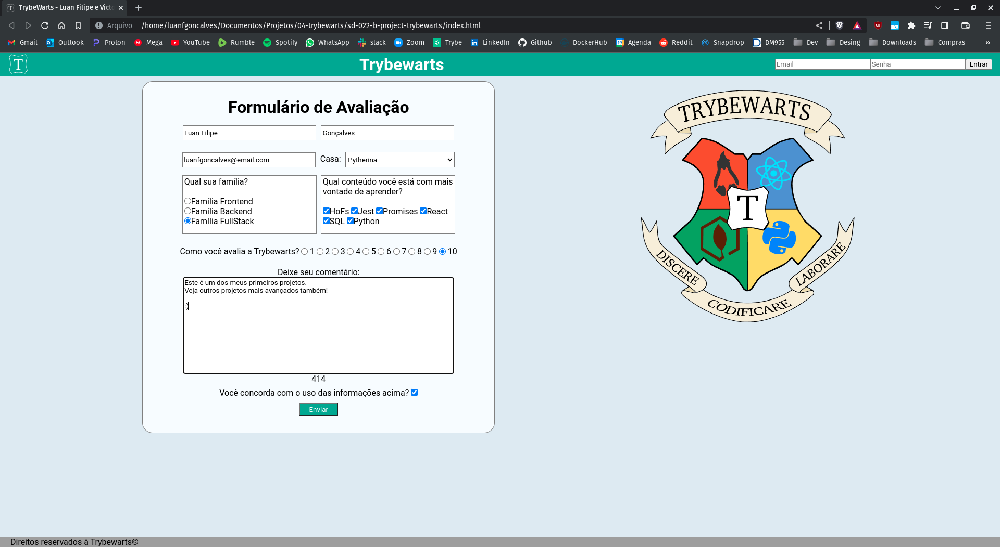

<!-- Introdução -->
<h1 align="center"> Projeto Trybewarts  - :four: </h1>

<!-- Descrição -->
<p align="center">
Este é meu quarto projeto desenvolvido em minha jornada de aprendizado como desenvolvedor na Trybe,
nele desenvolvi uma página estilizada utilizando um formulário com sistemas de validação de inputs e armazenamento de dados.
</p>

#
<!-- Habilidades -->
<h2 align="center"> Habilidades Desenvolvidas: </h2>

* Utilizei _JavaScript_ para gerenciar formulários, validar dados e armazenar informações. :heavy_check_mark:
* Utilizei _HTML_ para constuir um formulário completo com multiplos inputs funcionais. :heavy_check_mark:
* Utilizei _CSS_ para estilizar e posicionar elementos, fornecendo feedbacks visuais ao usuário. :heavy_check_mark:

#
<!-- Preview -->
<h2 align="center"> Preview: </h2>

<div align="center">
    
</div>

#
<!-- Ferramentas utilizadas -->
<details align="center">
  <summary>
	  <h2>Ferramentas e Tecnologias utilizadas:</h2>
	</summary>

  <div align="center">

  | Linguagens              | Tecnologias             |
  | :---------------------- | :---------------------- |
  | JavaScript              | HTML                    |
  | .                       | CSS                     |

  </div>

</details>

#
<!-- Instalação e utilização -->
<details align="center">
  <summary>
    <h2>Como instalar e utilizar o projeto:</h2>
  </summary>

<details>
  <summary>
    <h3>Especificações Tecnicas:</h3>
  </summary>

  <div align="left">
  
  * Git - <i> `git -v` informará a versão em uso.</i>

  </div>

  #

  </details>

  <div align="left">
    
  1. Faça a clonagem do projeto - <i>Nenhuma dependência externa é utilizada.</i>
  ```shell
  git clone git@github.com:luanfgoncalves/project-trybewarts.git
  ```
  2. Abra o arquivo `index.html` - <i>Os arquivo no diretório do projeto são necessários para a execução.</i>


  </div>

</details>

#
<!-- Meu contato -->
<h2 align="center"> Connect with me: </h2>

<div align="center">
  <a href="https://instagram.com/luanfgoncalves" target="_blank"></a>
  <a href = "mailto:luanfgoncalves@outlook.com"></a>
  <a href="https://www.linkedin.com/in/luanfgoncalves/" target="_blank"></a> 
</div>
